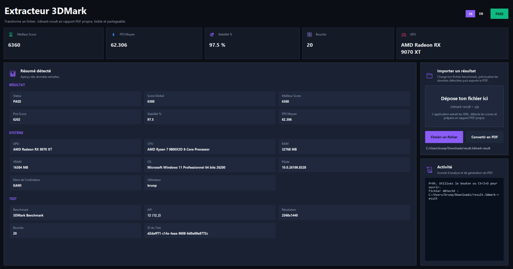
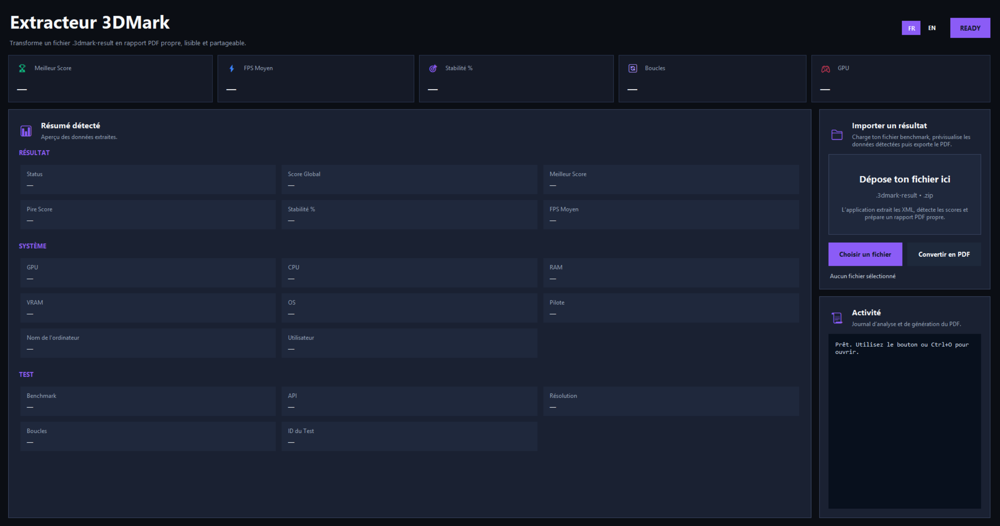
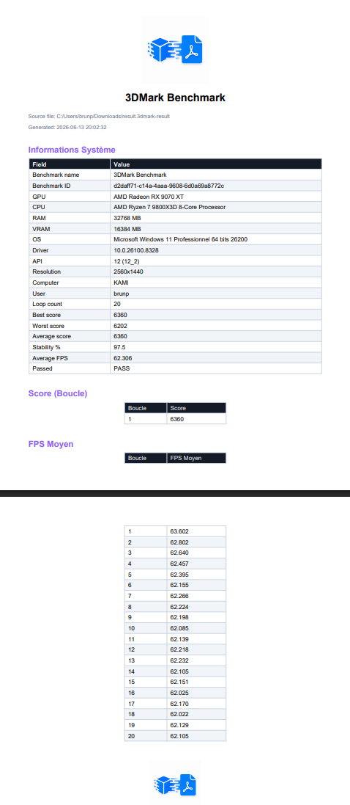

# Extracteur 3DMark

Extracteur 3DMark est une application open-source permettant de lire et d'extraire rapidement les données des fichiers de résultats 3DMark (`.3dmark-result`). L'application génère un résumé propre des performances (CPU, GPU, Températures, Fréquences, Scores) et permet de l'exporter en PDF.

## Fonctionnalités
- Importation et analyse de fichiers `.3dmark-result` et `.zip`.
- Extraction des scores globaux et graphiques.
- Analyse complète du matériel (CPU, GPU, RAM, Carte Mère).
- Exportation facile des données sous format PDF propre.
- Interface moderne et fluide.

## Captures d'écran


*L'interface principale affichant les données extraites d'un benchmark.*


*L'application prête à analyser vos fichiers.*


*Exemple du rapport PDF généré automatiquement.*

## Installation et Utilisation
Vous pouvez installer l'application complète via l'exécutable d'installation disponible dans le dossier des releases de ce projet.

1. Téléchargez `Install_Extracteur_3DMark.exe`.
2. Lancez l'installateur et suivez les instructions.
3. Lancez "Extracteur 3DMark" depuis votre bureau ou menu démarrer.

## Compilation depuis le code source
Si vous souhaitez compiler l'application vous-même :
1. Assurez-vous d'avoir Python installé (ainsi que `pip`).
2. Installez les dépendances :
   ```cmd
   pip install -r requirements.txt
   ```
3. (Optionnel) Pour créer l'installateur complet, installez Inno Setup et exécutez :
   ```cmd
   python build.py
   ```

## Licence
Ce projet est distribué sous la licence **Creative Commons Attribution-NonCommercial 4.0 International (CC BY-NC 4.0)**.
Vous êtes libre d'utiliser, de modifier et de distribuer ce logiciel pour des projets personnels ou open-source, **à condition de respecter ces deux règles absolues :**
1. **Pas d'utilisation commerciale** : Interdiction absolue de vendre ou monétiser ce logiciel ou son code.
2. **Mention obligatoire de l'auteur** : Vous devez explicitement créditer l'auteur originel (`Kamikaze_TM`) en cas de réutilisation ou de modification.
